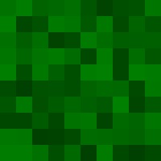

<meta name="google-site-verification" content="Wby9p_eTBuhZCnwZryTc8LsCvXkjgZVVj4wgx9D_e90" />

  

    I am a PhD student in Operations Research at Cornell Tech. I am interested in developing robust and scalable causal discovery algorithms, with applications to downstream causal inference. I am advised by Professor <a href="https://kyra-gan.github.io/" target="_blank" style="text-decoration: none; color: blue;">Kyra Gan</a>.
  

  

    
  

## Published Papers
- **Hybrid Top-Down Global Causal Discovery with Local Search for Linear and Nonlinear Additive Noise Models.**  *Hiremath S., Maasch J., Gao M., Ghosal P., Gan K.*
  - [Proceedings of the 38th Conference on Neural Information Processing Systems (*NeurIPS*), 2024](https://openreview.net/pdf?id=xnmm1jThkv).

## Preprints
- **LoSAM: Local Search in Additive Noise Models with Unmeasured Confounders, a Top-Down Global Discovery Approach.**  *Hiremath S., Ghosal P., Gan K.*
  - [arXiv October 2024](https://arxiv.org/abs/2410.11759).

## Working Projects
- Causal Discovery + Diffusion (with [Promit Ghosal](https://sites.google.com/view/promit-ghosal/home), [Kyra Gan](https://kyra-gan.github.io/)).

## Miscellaneous
- [Resume](Resume.pdf)
- [LinkedIn](https://www.linkedin.com/in/sujaihiremath/)
- [Contact](mailto:sh2583&#64;cornell&#46;edu)

